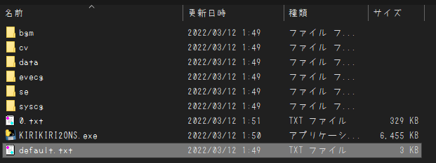

# KIRIKIRI2ONS_APTIT-sobo
## なにこれ
 かつて美少女ゲームをZaurusやPSPへ勝手移植する際によく使われた、 
 いわゆる"ONSコンバータ"(激古)です 
 Pythonの勉強を兼ねて作ってみました ~~もっと真面目に勉強しろ~~ 

## 使い方
1. [GARBro](https://drive.google.com/file/d/1gH9nNRxaz8GexN0B1hWyUc3o692bkWXX/view)で元作品のXP3をすべて展開(復号化はHashCrypt/画像はPNGで出力)
2. [このコンバータ](https://github.com/Prince-of-sea/KIRIKIRI2ONS_APTIT-sobo/releases/latest)を展開物と同じ場所に置いておく
3. py(またはexe)を叩いて0.txtが出たら完☆成 やったぁ！
4. [任意].ksや.tjs等のいらない展開物の削除とか
   
 
 ↑最終的にはこんな感じ 使い終わったらコンバータは消してOK 

## 現時点での対応タイトル(URLのh抜き)
 - ttps://ｗｗｗ.appetite-game.com/apt_138.html

タイトルの時点でいろいろアウトなのでURL表記で誤魔化して書いています(誤魔化せているとは言っていない) 
将来的に対応作品は増やす予定ですが、~~作者にやる気が無いため~~再現性向上アップデートは(多分)ないです 

### 実装済
 - 基本的な文字/立ち絵/CG等の表示
 - ルート分岐(手動)
 - タイトル
 - セーブ
 - ロード

### 未実装
 - 作品内選択肢によるルート分岐
 - システム周りの効果音全般
 - バックグラウンドボイス
 - エンディング時の背景
 - クイックロード
 - メニュー画面
 - オプション
 - バックログ
 - 回想モード

とりあえず初見プレイでも体験を損なわない程度には再現できてます 
~~MPPC製昆布割とこんな感じの適当な出来のやつ多かったよね~~ 

## 注意事項など
### 基本
 - 大前提として**ジョークアプリです** 実 用 性 皆 無
 - 普通にスマホで遊びたいなら[Kirikiroid2](https://github.com/zeas2/Kirikiroid2/releases)使ってください
 - 本ツールの使用において生じた問題や不利益などについて(以下略)
### おまけ
 [PSP向け自動変換ツール作ってます](https://github.com/Prince-of-sea/ONScripter_Multi_Converter) もしよかったら使って、どうぞ。