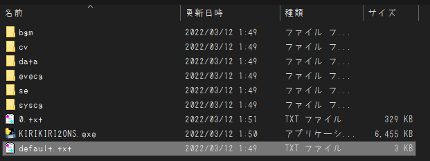

# KIRIKIRI2ONS_APTIT-sobo
## なにこれ
 かつて美少女ゲームをZaurusやPSPへ勝手移植する際によく使われた、 
 いわゆる"ONSコンバータ"(激古)です 
 Pythonの勉強を兼ねて作ってみました ~~もっと真面目に勉強しろ~~ 

## 現時点での対応タイトル
 - www.appetite-game.com/apt_085.html
 - www.appetite-game.com/apt_095.html
 - www.appetite-game.com/apt_102.html
 - www.appetite-game.com/apt_104.html
 - www.appetite-game.com/apt_108.html
 - www.appetite-game.com/apt_121.html
 - www.appetite-game.com/apt_130.html
 - www.appetite-game.com/apt_138.html
 - www.appetite-game.com/apt_155.html
 - www.appetite-game.com/apt_173.html

多分各作品の体験版でも動作すると思います(未確認) 
 
Github上で書いたら消されかねないタイトルなのでURL表記で誤魔化してます(誤魔化せているとは言っていない) 
v1.5.0でとりあえず(画面比率4:3の)祖母シリーズは全て移植完了しました ~~...まだ動作確認してないけど~~ 
誰かから依頼があったら同ブランドの作品を新規に対応しますが、一旦はここで追加ストップです 

## 再現度リスト

### 実装済
 - 作品内選択肢によるルート分岐(一部未実装)
 - 基本的な文字/立ち絵/CG等の表示
 - 簡易的なメニュー画面
 - タイトル
 - セーブ
 - ロード

### 未実装
 - システム周りの効果音全般
 - バックグラウンドボイス
 - エンディング時の背景
 - クイックロード
 - オプション
 - バックログ
 - 回想モード

とりあえず初見プレイでも体験を損なわない程度には再現できてます 
~~MPPC製昆布割とこんな感じの適当な出来のやつ多かったよね~~ 

## 使い方
1. 【data.xp3がある場合】[GARBro](https://drive.google.com/file/d/1gH9nNRxaz8GexN0B1hWyUc3o692bkWXX/view)で元作品のXP3をすべて展開(復号化が必要な場合はHashCryptで展開/画像はPNGで出力) 
   【data.xp3がない場合】data内の全tlgをpngに変換＆bgm/cv/se/evecg/syscgをデータの外に
2. [このコンバータ](https://github.com/Prince-of-sea/KIRIKIRI2ONS_APTIT-sobo/releases/latest)を展開物と同じ場所に置いておく
3. py(またはexe)を叩いて0.txtが出たら完☆成 やったぁ！
4. [任意].ksや.tjs等のいらない展開物の削除とか
   
 
 ↑最終的にはこんな感じ 使い終わったらコンバータは消してOK 

## 注意事項など
### 基本
 - 大前提として**ジョークアプリです** 実 用 性 皆 無
 - 普通にスマホで遊びたいなら[Kirikiroid2](https://github.com/zeas2/Kirikiroid2/releases)使ってください
 - 本ツールの使用において生じた問題や不利益などについて(以下略)
### おまけ
 [PSP向け自動変換ツール作ってます](https://github.com/Prince-of-sea/ONScripter_Multi_Converter) もしよかったら使って、どうぞ。